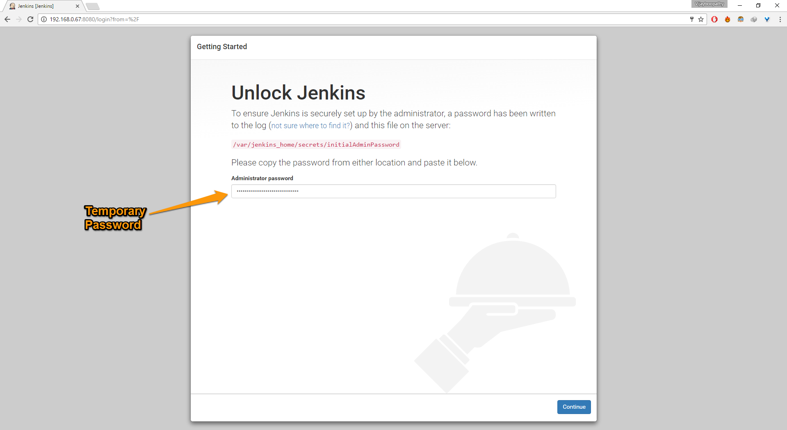
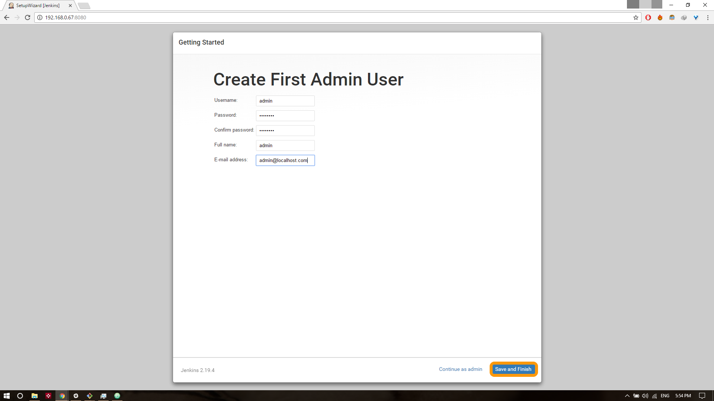

# JENKINS

Jenkins is a essential automation tool to setup Continuous Integration. Its the integrator which helps you build your development,  testing and deployment  workflow and create job pipelines. It also adds visibility to all stake holders including the Dev, QA, Ops teams involved in building, testing and deploying the product.

## Installing Jenkins With Docker

### Installing Docker Engine

Proceed with installing Docker Engine on your choice of Operating System. For details on how to install docker visit the official installation page at  [docs.docker.com](https://docs.docker.com/engine/installation/).

We assume you have installed docker and are ready to launch containers before proceeding. To validate docker environment run.

```
docker ps
```

If the above command goes through without errors, you are all set.

After installing docker, pull our Jenkins docker image from [docker hub](https://hub.docker.com/_/jenkins/).

This is the simplest way of installing Jenkins and requires minimal efforts.

We do this by using a docker-compose file. Don't bother about learning about docker-compose now. You will be explained later. just run the following commands in the same sequence.

```
git clone http://github.com/schoolofdevops/learn-jenkins
git checkout vertx-v1
cd build
docker-compose up -d
```

This command (docker-compose up -d) will bring up the whole infrastructure. **If** you want to bring up **jenkins alone** run the following command.

```
docker-compose up -d jenkins
```

## Common Post Installation Steps

After the installation, you will be asked for password. The password will be saved in the following file.

```
/var/jenkins_home/secrets/initialAdminPassword
```

Password can be also fetched from the logs. You could run the following command to view the password,

```
docker logs jenkins
```

or to follow the logs

```
docker logs -f jenkins

[use ^c to come back to the terminal]
```




Select **Install Suggested Plugins** when given an option. This will install all common plugins such as git, gradle, svn, ssh, pipeline which are quiet handy.

Create Admin user



Now we have successfully installed Jenkins and we can proceed with configurations


