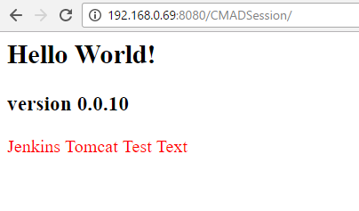
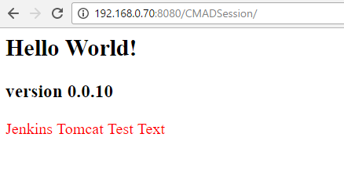

# Deploy application to a Docker Swarm cluster
## Minimun Requirements
* No of machines: 2
* RAM : 2 GB each
* Docke-Engine should be installed on both of the machines

## Create a Swarm
* In order to create a swarm cluster, we need to have a swarm manager.
* Create a swarm manager by running the following command on machine 1.

```
docker swarm  init --addvertise-addr 192.168.0.69
```

[Output]

```
Swarm initialized: current node (kc6sdrdmmgz8yeq1j67drze87) is now a manager.

To add a worker to this swarm, run the following command:

    docker swarm join \
    --token SWMTKN-1-1gxql1vsrtj08h7t9tbpqig0ottub8xf1p9gr80pca9eqz15vf-2gm60u6sb6ua7kze4ji553xht \
    192.168.0.69:2377

To add a manager to this swarm, run 'docker swarm join-token manager' and follow the instructions.
```

## Add a node to the cluster
* After initializing the swarm, we need to add nodes to that swarm
* To do that, copy **docker swarm join** command from the output of **docker swarm init** command.
* Run that command on the second machine

```
docker swarm join \
>     --token SWMTKN-1-1gxql1vsrtj08h7t9tbpqig0ottub8xf1p9gr80pca9eqz15vf-2gm60u6sb6ua7kze4ji553xht \
>     192.168.0.69:2377
```

[Output]

```
This node joined a swarm as a worker.
```
* Run the following command on machine 1 to see if we have added the worker node or not.

```
docker node ls
```

[Output]

```
ID                           HOSTNAME        STATUS  AVAILABILITY  MANAGER STATUS
jj23o72ids8tn9jv6v17458ep    docker-swarm-2  Ready   Active
kc6sdrdmmgz8yeq1j67drze87 *  docker-swarm-1  Ready   Active        Leader
```
* We have successfully created a swarm cluster for us to work with.

## Deploy an application
* To deploy an application to the swarm cluster, we need to create an entity called **service**.
* Run the following command on manager(machine 1) node.

```
docker service create --replicas 2 --publish 8080:8080 --name tomcat dialectpython/customtom
```

[Output]

```
umtxgnvps6nzvd49etjg6a9vd
```

* Here, **replicas** states the number of container we want to run and **--publish** exposes port 8080 from container to host.
* Replace dialectpython/cmadapp with your own tomcat image that you have pushed to Docker Hub in the previous chapter.
* After executing that command, wait for one minute for docker to pull the image and create the service.
* Then Execute the following command.

```
docker service ls
```

[Output]

```
ID            NAME    MODE        REPLICAS  IMAGE
7rlbg3raq28w  tomcat  replicated  2/2       dialectpython/customtom:latest
```

* If you run **docker ps** on either of two machines, you can see the container is running

# Verify the operation
* Let's check our whether our application is working or not.
* Visit both of machine's IP's in browser followed by your application's name

```
http://Your_Machine'sIP:8080/CMADSession
```

* In the above mentioned URL, CMADSession is my context path. Replace it with your context path





* As you can see, our application is being served by two conainers in Docker Swarm

----
:point_left:[**Prev** Chapter 13: Pushing our Application to Docker Hub Registry Job](https://github.com/schoolofdevops/learn-jenkins/blob/master/manuscript/130_DockerHub_registry.md)

:point_right:[**Next** Chapter 15: Monitoring Containers](https://github.com/schoolofdevops/learn-jenkins/blob/master/manuscript/150_monitoring_containers.md)
